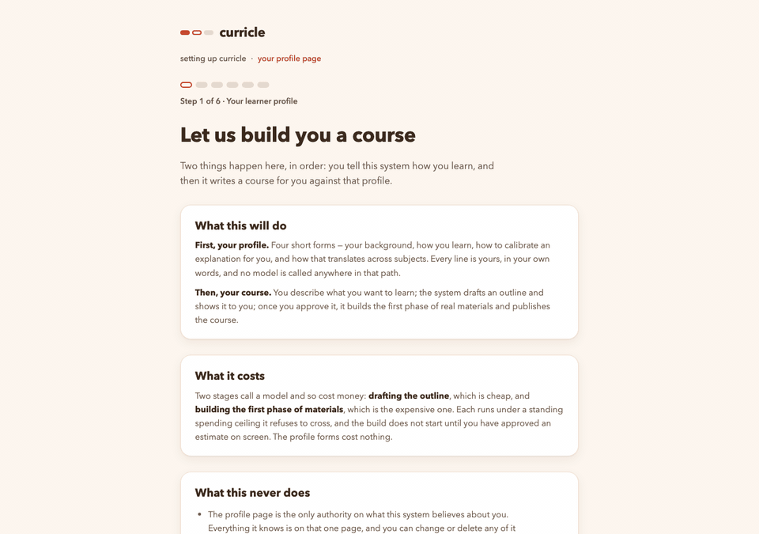
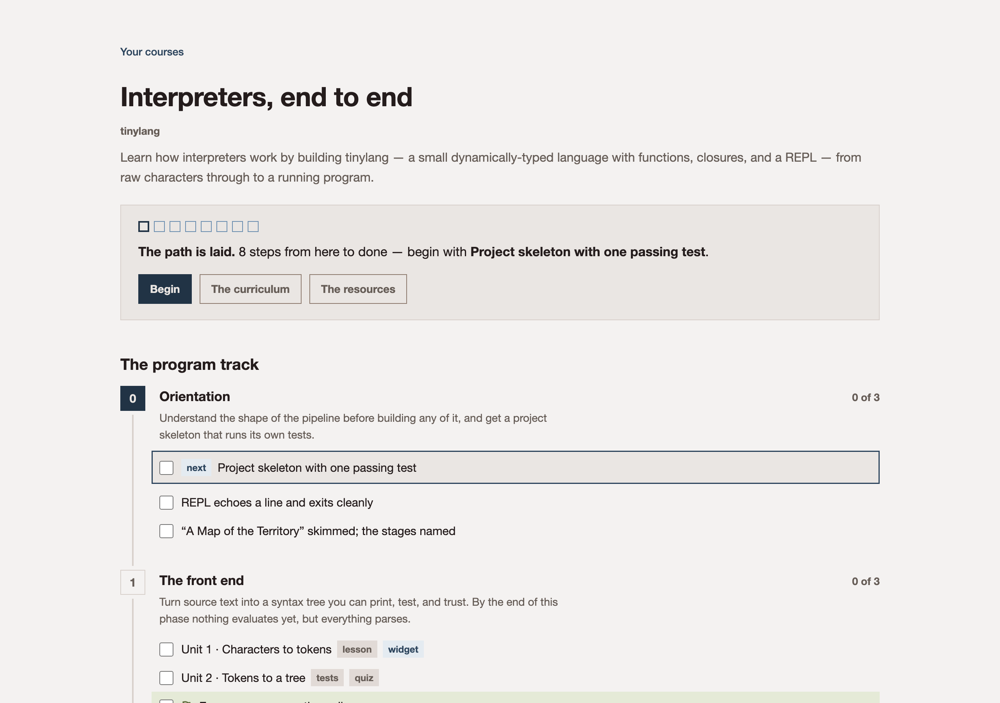
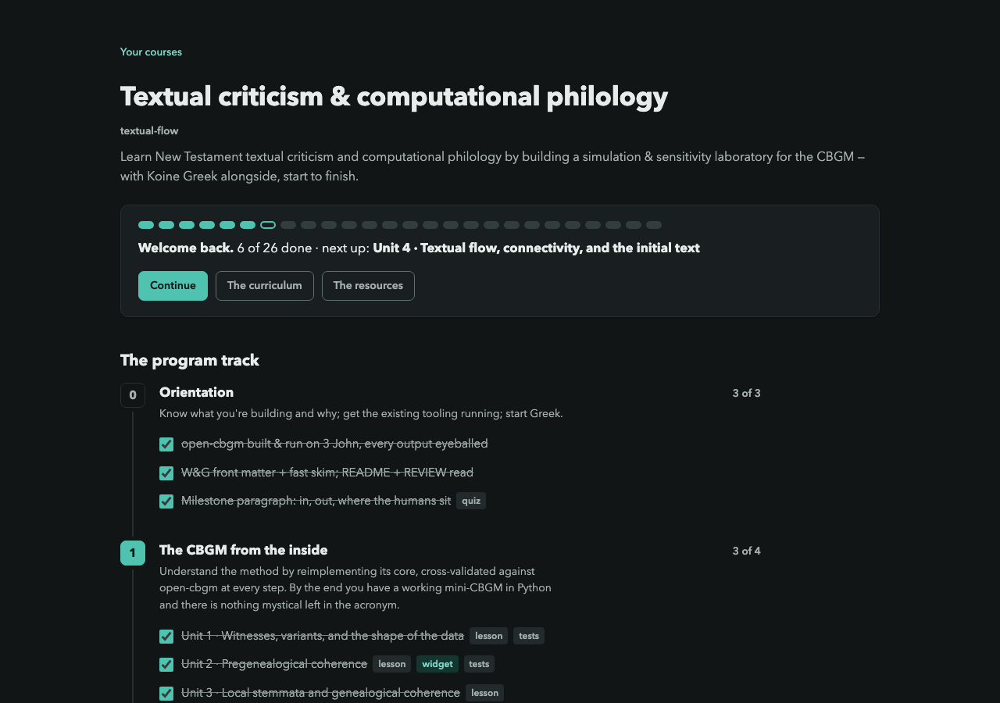

# curricle

A personalized-learning platform for one person, run on your own machine.
Tell it how you learn, in your own words; describe what you want to build;
approve a price; and it drafts, builds, checks and publishes a course
calibrated to you — with a path you can walk, materials you can run, and a
tutor that is your own assistant.



## What makes it different

- **The course is data, and the data is honest.** A `curriculum.md` you can
  read compiles, with a small `course.yaml` sidecar, into one validated
  manifest that every page, the progress ledger, the factory and the tutor
  render from. Ids are forever, derived data is never stored, and the compiler
  refuses rather than guesses — every issue names a place you can act on.
- **The model is on a leash.** No LLM call is ever on a request path. Every
  call goes through one metered runner with a token ledger and a per-stage
  budget; the only file that names a model or a price is `models.yaml`.
  Generated material is refused, not reviewed: an exercise's generated tests
  are run against the stub, and if they pass, the build fails.
- **Money is shown before it is spent.** The wizard drafts an outline, then
  puts the estimate and the headroom left before the runner refuses on the
  screen you approve from, and prints the receipt when you land.
- **The tutor is yours.** The course, your profile, your progress, the lesson
  guides and the question bank are exported over MCP to whatever assistant you
  already use, at your own inference cost. The profile it reads is a generated
  projection of an evidence ledger — the learner's own claims, and what the
  course actually demonstrated — never a file anyone edits by hand.
- **It says only what it knows.** Elapsed time, never a forecast; a progress
  path of real steps, never a percentage it would have to invent; evidence
  tiers named in words, with colour as reinforcement.

<p align="center">
  
  
</p>

The design and its decided trade-offs are in
[`docs/platform-design.md`](docs/platform-design.md); the schema is specified
in [`docs/platform-manifest.md`](docs/platform-manifest.md); the design system
and its contrast provenance are in [`DIRECTION.md`](DIRECTION.md).

## Quickstart

Requires Python 3.12+. Nothing below needs a database.

```bash
python -m venv .venv && source .venv/bin/activate
pip install -e .

# Compile the example course, then render its pages beside it
python -m curricle compile    examples/tinylang --out build/tinylang.manifest.yaml
python -m curricle hub        examples/tinylang --out examples/tinylang/learning/index.html
python -m curricle curriculum examples/tinylang --out examples/tinylang/learning/curriculum.html
python -m curricle resources  examples/tinylang --out examples/tinylang/learning/learning-resources.html
python -m curricle theme                        --out examples/tinylang/learning/theme.css
# then open examples/tinylang/learning/index.html in a browser
```

The pages go beside the course because everything they link is relative to it —
the curriculum, the widget, the quiz — and `theme.css` is what styles the widget
and the quiz when there is no server to hand it out. The four files that land
beside the course are gitignored, so this leaves the tree clean.

[`examples/tinylang`](examples/tinylang/README.md) is a real, complete course —
build a small interpreted language over eight weeks — and it is the template to
copy when you want one of your own. It is deliberately small — an orientation
phase and two working phases, four numbered units — but it exercises every part
of the schema: a parallel track, a milestone that is not a unit, all four
material kinds, a grader, tiered resources, and all four reference schemes in
the prose.

## Running the served app

The static pages keep their state in the browser. The served app keeps it in
Postgres as an append-only event ledger, adds the reader and the unit pages,
and is the mode the rest of the platform is built around. It needs a Postgres
you can reach and it binds to localhost — see [Security posture](#security-posture).

```bash
export CURRICLE_DATABASE_URL="postgresql+psycopg:///curricle"
alembic upgrade head
python -m curricle tenant create example
python -m curricle serve --course examples/tinylang --tenant example --port 8765
# then: http://localhost:8765/
```

Pass `--course` more than once to serve several courses from one front door.

To run it somewhere permanent instead of a terminal, there is a published
container image and a worked deployment:
[`docs/self-hosting.md`](docs/self-hosting.md).

### Your first course

A tenant with no courses lands in the onboarding wizard at `/onboarding/`:
four profile forms in your own words, a read-back you publish, a scope form,
an outline the model drafts and shows you behind a cost estimate, and then —
only after you approve that number — the first phase of materials, built,
compiled and put in place. Two things beyond the block above make it work: a
managed directory the wizard writes new courses into, and a second process
that runs the model-calling stages so the web app never does.

```bash
export CURRICLE_DATABASE_URL="postgresql+psycopg:///curricle"
export CURRICLE_COURSES_DIR="$HOME/curricle-courses"   # no default; new courses land here
export ANTHROPIC_API_KEY=…                              # or put the key in local/anthropic-key
alembic upgrade head
python -m curricle tenant create you
python -m curricle serve --tenant you --port 8765       # no --course: the wizard creates one
python -m curricle work                                  # in a second terminal: the worker
# then: http://localhost:8765/
```

Two stages spend money — drafting the outline, which is cheap, and building
phase 1, which is the expensive one — and each refuses to spend past its
configured ceiling. The profile forms call no model. A twelve-unit course cost
about three dollars end to end at today's prices. Role contracts and prices
are read from `roles/` and `models.yaml` at the checkout root, so this is a
checkout-mode feature: an installed package has the compiler and the app but
must be told where those live (`CURRICLE_HOME`).

`python -m curricle mcp --course <course_root> --tenant …` exports the same
course to your own assistant as an MCP server over stdio — the manifest, the
profile, progress, lesson guides and the question bank as tools it can call.
The config block to paste, and what the tutor may read and write, are in
[`docs/mcp-config.md`](docs/mcp-config.md).

`python -m curricle import-progress <course_root> --tenant … --json '<paste>'`
is a one-time migration helper: it takes a JSON dump of a hand-built course
page's `localStorage` and replays it into the ledger. You need it only if you
are moving a course that already had learner state in a browser.

## The learner profile

The profile is a fold over an evidence ledger, and the skill file every Claude
session reads is a **generated projection** of it — never hand-edited. Evidence
tiers come from provenance, not confidence: `attested` (the learner said it),
`demonstrated` (course activity proved it), `thin` (claimed, uncorroborated).
The agent proposes; the human publishes.

```bash
python -m curricle profile import-seed examples/example-profile-seed.yaml --tenant example
python -m curricle profile show   --tenant example
python -m curricle profile render --tenant example --out build/example-profile-SKILL.md
```

[`build/example-profile-SKILL.md`](build/example-profile-SKILL.md) is exactly
what those commands produce from the example seed. Point `--out` at
`~/.claude/skills/learner-profile/SKILL.md` once it is your own profile.

Checkpoint quizzes POSTed to the events API become *proposed* `demonstrated`
evidence, misses included, and wait on the `/profile` page until you accept
them.

## The course factory

The factory drafts a phase's interactive layer — lesson guide, widget,
exercise, quiz, question bank — calibrated by the derived profile and by
exemplars from the course's own earlier phases.

```bash
# Key from ANTHROPIC_API_KEY or gitignored local/anthropic-key
python -m curricle factory build-phase <course_root> --phase 2 \
    --tenant example --lesson u4 --widget u3 --exercise u3 [--dry-run]
python -m curricle factory promote <course_root> --phase 2
```

**This spends your own money.** Every call goes through a metered runner that
writes a token ledger and refuses once a stage passes its budget; the budgets
and the only mention of any model or price live in
[`models.yaml`](models.yaml), so changing either is a YAML edit. Start with
`--dry-run`, which assembles the prompts and reports their sizes without
calling the API.

**The factory is a checkout-mode feature.** `models.yaml` and `roles/*.md` are
operator-editable configuration — you change a price or reword a role contract
by editing a file you can see — so they live at the checkout root rather than
inside the package. `pip install curricle` therefore gets you the compiler, the
renderers, and the web app, but the factory needs the files: run it from a
clone, or point `CURRICLE_HOME` at a directory holding `models.yaml` and
`roles/`. Either way it says so plainly rather than failing obscurely.

Outputs are refused rather than reviewed: generated exercise tests are executed
against their stub, and if they pass, the build fails. Drafts land in
`interactive/.draft-pN/` and only `factory promote` touches the course — and it
aborts unless the compile stays clean.

## Layout

- `curricle/schema.py` — the manifest data model. **This module is the contract**:
  strict decoding, enumerated vocabularies, derived data (`progress_ids()`,
  `tags_for_unit()`) computed rather than stored.
- `curricle/mdparse.py` — parser for the `curriculum.md` house format (phases,
  unit rows, checkpoints, check-yourself blocks, version footers). Two dialects:
  `bullets` and `headings`.
- `curricle/sidecar.py` — strict loader for `course.yaml`.
- `curricle/compiler.py` — merge + validate + refuse. House rules become errors
  or warnings here: dangling refs, unregistered files, bare URLs in prose,
  vanished ids. Every issue names a place you can act on.
- `curricle/refs.py` — the `res:` / `unit:` / `mat:` / `repo:` link schemes,
  validated at compile and resolved per medium at render.
- `curricle/db.py` — tables and the tenancy invariants, satisfied by
  construction: every table classified at import, `TenantScope` the only path
  to scoped rows, purge and export derived from the classification.
- `curricle/progress.py` — the event ledger's pure fold and append-time
  validation against the manifest.
- `curricle/profile.py`, `profilerender.py` — the evidence ledger and its
  projections (the skill file, the review page).
- `curricle/llm.py`, `factory.py` — the metered runner and the course factory.
  No LLM call is ever on a request path.
- `curricle/theme.py` — the design system: one set of tokens, the shared
  stylesheet, the waypath. Renderers compose `theme.style(own_css)` rather than
  carrying palettes of their own. Rationale and the computed contrast table are
  in [`DIRECTION.md`](DIRECTION.md).
- `curricle/webapp.py` — the FastAPI app serving the views in server mode.
- `migrations/` — Alembic; the schema changes by migration only.
- `build/` — compiled manifests and rendered pages, committed for inspection
  and regenerated in the same commit as any change upstream of them.
- `examples/` — the tinylang course and the example profile seed.

## Tests

```bash
python -m unittest discover tests
```

The suite brings its own Postgres: a throwaway `initdb` cluster per process on
a unix socket in a temp directory, migrated and torn down at exit. It never
reads a database URL from the environment and so cannot be pointed at a real
database.

[`CONTRIBUTING.md`](CONTRIBUTING.md) has the setup details and the house rules.
Two things worth knowing before you read a green run as full coverage:

- `tests/test_corpus.py` runs against private sibling course repos and
  **skips cleanly when they are absent**, which is the normal case for anyone
  but the author. `tests/test_example_course.py` covers the same ground against
  `examples/tinylang` and never skips.
- The progress-id list pinned in `test_corpus.py` is a migration-safety
  contract against real learner state, not an assertion about current
  behaviour. Don't "fix" it to match the code; fix the code to match it, or
  migrate deliberately.

## Security posture

curricle is **single-tenant by instance** and has no authentication. The tenant
is resolved once at startup, there is no default tenant anywhere (an
unconfigured caller gets an exception, never tenant 0), and `serve` binds
`127.0.0.1` unless you say otherwise. That is the design for one person on
their own machine, not an oversight.

`--host` widens the bind, and the default is deliberately the narrow one so
that exposure is always something a person typed. The case it exists for is a
container, where `127.0.0.1` is the container's own loopback and a published
port would reach nothing at all; there the narrow bind belongs on the host's
publish instead. **Passing `--host` makes authentication your job** — put the
app behind something that has some. See
[`docs/self-hosting.md`](docs/self-hosting.md).

It is not built to be exposed to a network. Anyone who can reach the port is
the tenant. If you put it behind a public address, you are the one adding
authentication.

The `repo/` route hands out only manifest-blessed paths and every file-serving
route resolves and prefix-checks against its root, so a course repo's
gitignored `local/` — seeds, API keys — is not reachable through the app.

## Invariants (enforced, not aspirational)

- Ids are forever: `num` may change, `id` may not; removal requires a tombstone.
- Attachment is declared once, on the material; tags and file tables derive.
- Derived data is computed, never stored. If something derivable is being
  persisted, that is the bug.
- The event ledger is append-only and the fold is pure, ordered by row id and
  never by timestamp. Anything stored beside the ledger is a projection, and a
  disagreement is a bug in the projection.
- No LLM call on a request path, ever.

## Status

Phases 0–4 are built: the manifest compiler, the progress service, the profile
pipeline, the course factory, the design system, and the onboarding wizard
that takes an empty tenant to a first course. What is not here yet: auth,
multi-tenant serving, and a real background job queue — the factory runs from
the CLI or from the single `work` process, which is a thin slice of the queue
to come. See [`docs/platform-design.md`](docs/platform-design.md) §9 for the
roadmap.

## License

[Apache License 2.0](LICENSE).
